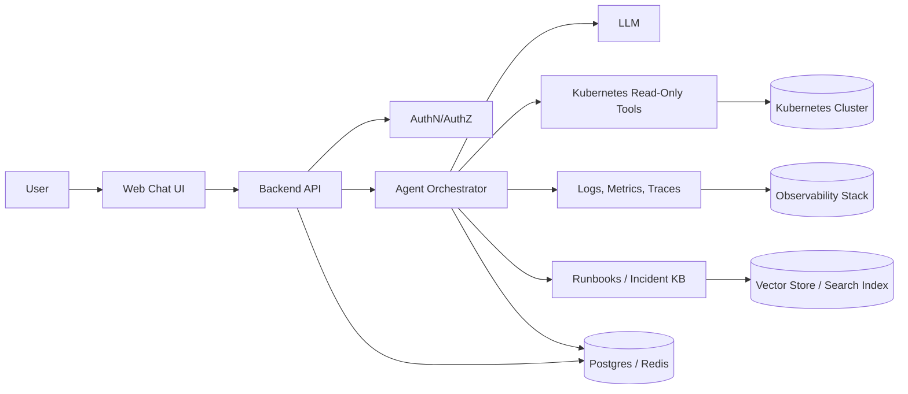

# noma: Kubernetes AI Agent Architecture

This repository currently serves as the design spec for an AI troubleshooting agent for Kubernetes. The goal is a chat interface where engineers ask about cluster issues and get evidence-backed answers from live cluster data, logs, metrics, and runbooks.

## Product Goal

Build a chat-based assistant that can:

- Diagnose Kubernetes issues from cluster state, events, logs, and metrics
- Explain likely root causes in plain language
- Ask clarifying questions when the evidence is insufficient
- Suggest safe next checks or approved remediation steps
- Keep full auditability for every tool call and answer

The agent should be read-first and safe-by-default. It should not have broad write access to the cluster.

## Core Principles

- Evidence over guesswork: every answer should cite live data or retrieved runbook knowledge
- Least privilege: default permissions are read-only and namespace-scoped
- Tool-driven reasoning: the model plans, but the backend executes controlled tools
- Human approval for mutations: scaling, restarts, rollbacks, and config changes require explicit approval
- Auditability: every user message, tool call, and response is logged

## High-Level Architecture

## Main Components

### 1. Web Chat UI

The UI is the operator-facing entry point.

Responsibilities:

- Display conversation history and streaming responses
- Collect optional context such as cluster, namespace, workload, and time range
- Render citations and evidence cards
- Surface approvals for any write action

Recommended stack:

- Next.js or React
- Server-side streaming for token-by-token responses
- Auth-aware UI with cluster and namespace selectors

### 2. Backend API

The API is the trust boundary between the browser and the agent system.

Responsibilities:

- Authenticate users via OIDC/SSO
- Map user identity to allowed clusters and namespaces
- Persist conversations, feedback, and audit logs
- Route messages to the agent orchestrator
- Enforce rate limits and policy checks

Recommended stack:

- FastAPI, Node.js, or Go
- Postgres for durable records
- Redis for short-lived session state and streaming coordination

### 3. Agent Orchestrator

This is the reasoning and planning layer. It does not directly talk to Kubernetes itself; it selects tools and interprets results.

Responsibilities:

- Classify the user intent: diagnosis, comparison, status lookup, or remediation request
- Ask clarifying questions when required fields are missing
- Select the smallest useful set of tools
- Combine outputs into a root-cause summary
- Decide whether the result is high, medium, or low confidence

Best implementation options:

- OpenAI tool calling with a structured tool schema
- LangGraph for multi-step stateful flows
- Semantic Kernel if you want a plugin-oriented style

### 4. Kubernetes Tool Layer

This layer exposes safe, typed, read-only operations.

Recommended tools:

- `list_clusters`
- `list_namespaces`
- `get_deployments`
- `get_statefulsets`
- `get_daemonsets`
- `get_pods`
- `get_pod_events`
- `get_pod_logs`
- `describe_resource`
- `get_service`
- `get_ingress`
- `get_hpa`
- `get_nodes`
- `get_resource_quota`
- `get_recent_changes`

Each tool should return structured JSON, not raw text blobs. That keeps the model grounded and makes the UI easier to render.

### 5. Observability Layer

The agent becomes much more useful when it can correlate Kubernetes state with telemetry.

Sources to integrate:

- Prometheus for metrics
- Loki or ELK for logs
- OpenTelemetry for traces
- Grafana for dashboards and deep links

Use cases:

- Detect OOMKills from memory trends
- Detect latency regressions from request duration metrics
- Detect failing rollouts from event spikes and error logs

### 6. Knowledge Base

This is optional in the MVP but important for good answers.

Content to index:

- Runbooks
- Postmortems
- Internal troubleshooting docs
- Common failure patterns and known fixes

Implementation options:

- Full-text search for exact matches
- Vector search for semantic retrieval
- Hybrid retrieval for precision plus recall

## Request Lifecycle

1. User asks a question in chat.
2. Backend authenticates the user and loads RBAC context.
3. Orchestrator determines whether more context is needed.
4. If needed, it asks a clarifying question like namespace, cluster, or workload name.
5. Orchestrator invokes Kubernetes and observability tools.
6. Results are normalized into structured evidence.
7. The LLM generates a diagnosis with confidence and next steps.
8. The UI displays the answer, source evidence, and optional follow-up actions.

## Example Diagnostic Flow

User: Why are payments-api pods restarting?

Typical tool sequence:

1. `get_deployments(namespace=payments, name=payments-api)`
2. `get_pods(namespace=payments, selector=app=payments-api)`
3. `get_pod_events(namespace=payments, pod=...)`
4. `get_pod_logs(namespace=payments, pod=..., container=...)`
5. `query_metrics(metric=container_memory_working_set_bytes, window=1h)`

Potential conclusion:

- Pods are being killed with `OOMKilled`
- Memory usage exceeds the configured limit during traffic spikes
- Likely cause: undersized memory limit or a memory leak introduced in the last deploy
- Recommended next step: confirm recent release diff, compare memory usage with previous version, and adjust memory limit if needed

## Data Model

Suggested persisted entities:

- `users`: identity and team mapping
- `clusters`: cluster metadata and access rules
- `conversations`: chat sessions and metadata
- `messages`: user and assistant turns
- `tool_calls`: tool name, parameters, result summary, latency, and status
- `incidents`: linked cases or tickets
- `feedback`: user ratings and corrections
- `audit_events`: immutable activity log

## API Surface

Minimal backend endpoints:

- `POST /chat/message` - send a user message
- `GET /chat/sessions` - list chat sessions
- `GET /chat/sessions/{id}` - fetch conversation history
- `GET /clusters` - list accessible clusters
- `GET /namespaces?cluster=...` - list authorized namespaces
- `POST /approvals/{id}` - approve a write action

Internally, the agent should use typed tool contracts instead of free-form text prompts for operational queries.

## Security Model

This is the most important part of the design.

### Identity and Access

- Use OIDC or SSO for authentication
- Map users to teams and roles
- Enforce cluster and namespace allowlists
- Avoid broad cluster-admin access

### Kubernetes Permissions

- Use separate service accounts per environment or team
- Prefer read-only ClusterRoles and RoleBindings
- Block access to Secrets by default
- Redact sensitive fields from logs and object descriptions

### Tool Safety

- Allowlist all tools
- Validate every tool argument
- Apply rate limits and payload size limits
- Store all tool calls in audit logs
- Require approval before any mutation

### Prompt Safety

- Treat tool output as untrusted input
- Never let retrieved content override policy rules
- Strip secrets, tokens, and private keys before they reach the model

## Deployment Topology

Recommended deployment shape:

- Web app behind a CDN or ingress controller
- API service in the application namespace
- Agent worker pool for concurrent conversations
- Read-only Kubernetes service account mounted in the backend
- Dedicated observability connectors for logs and metrics
- Postgres and Redis as managed services if possible

For multi-cluster support, keep cluster access isolated per tenant or environment. A per-cluster connector model is usually safer than one global super-user integration.

## Observability For The Agent Itself

You should also monitor the assistant.

Track:

- Request latency
- Tool-call latency
- Tool failure rate
- Conversation abandonment rate
- Answer helpfulness ratings
- Unsafe or blocked action attempts

This helps you identify whether the assistant is giving weak diagnoses or simply missing data.

## MVP Scope

Build the first version with a narrow surface area:

- One cluster
- Read-only access
- Namespace-scoped diagnosis only
- Pod, deployment, events, and logs tools
- Manual follow-up questions instead of fully autonomous remediation

That gets you to a useful troubleshooting assistant without the risk and complexity of write operations.

## Suggested Build Phases

### Phase 1: Read-only assistant

- Chat UI
- Authentication
- Kubernetes read tools
- Basic response streaming

### Phase 2: Observability correlation

- Prometheus and log integration
- Better root-cause summaries
- Evidence cards and links to dashboards

### Phase 3: Knowledge grounding

- Runbook indexing
- Incident search
- Retrieval-augmented answers

### Phase 4: Controlled remediation

- Approval workflow
- Safe actions like scaling or restarting
- Post-action verification

### Phase 5: Multi-cluster scale

- Tenant isolation
- Policy engine
- Per-team permissions and audit reporting

## Recommended Tech Stack

One practical stack for speed and clarity:

- Frontend: Next.js + TypeScript
- Backend: FastAPI or Node.js
- Agent orchestration: OpenAI tool calling or LangGraph
- Kubernetes client: official Kubernetes SDK
- Storage: Postgres + Redis
- Metrics: Prometheus
- Logs: Loki or ELK
- Auth: OIDC / SSO

## What Makes This Architecture Work

The design works because it separates responsibilities cleanly:

- The UI handles conversation and approvals
- The API handles identity, persistence, and policy
- The orchestrator handles reasoning
- The tool layer handles cluster data access
- The observability and knowledge layers provide context

That separation keeps the assistant accurate, secure, and maintainable.

## Local Development

This repo now includes the first runnable slice of the system:

- The backend serves a browser chat UI at `http://localhost:8000`
- `docker-compose.yml` runs Postgres, Redis, the backend API, and the agent service
- `kind` provides a local Kubernetes cluster for testing
- `k8s/rbac.yaml` grants the agent read-only access in the `noma` namespace
- The agent currently reads pods and deployments from the configured namespace and returns a structured diagnostic summary
- The backend now uses an LLM planner first to decide whether to ask follow-up questions, answer directly, or call the Kubernetes agent

Run it locally:

1. Create the cluster and apply RBAC: `./scripts/create-kind-cluster.sh`
2. The script writes a Docker-friendly `.env` with `KUBE_API_SERVER` for kind
3. Start the services: `docker compose up --build`
4. Test the backend: `curl http://localhost:8000/health`
5. Send a chat request: `curl -X POST http://localhost:8000/chat/message -H 'content-type: application/json' -d '{"message":"check pods in default namespace","namespace":"default"}'`

### LLM Configuration

Set these in `.env` for planner-driven behavior:

- `LLM_BASE_URL` (OpenAI-compatible API base)
- `LLM_API_KEY`
- `LLM_MODEL`

`LLM_API_KEY` is optional for local Ollama.

### Using Ollama Locally

1. Start Ollama: `ollama serve`
2. Pull a model once: `ollama pull llama2:latest`
3. Ensure `.env` contains:
	- `LLM_BASE_URL=http://host.docker.internal:11434`
	- `LLM_MODEL=llama2:latest`
	- `LLM_API_KEY=`
4. Rebuild backend: `docker compose up -d --build backend`

With this setup, the chat flow is planner-first (LLM decides follow-up question vs. agent call) and works fully with local Ollama.

## Built First

The first thing built is the thin vertical slice:

- Backend API receiving chat requests
- Agent service querying a live Kubernetes cluster read-only
- Postgres and Redis in compose for the future conversation and session state
- Kind cluster bootstrap and RBAC so the agent can be exercised locally

## Next Step

The next useful step is to turn this architecture into an implementation plan and repo scaffold, starting with the chat API, agent tool schema, and Kubernetes read-only connector.
