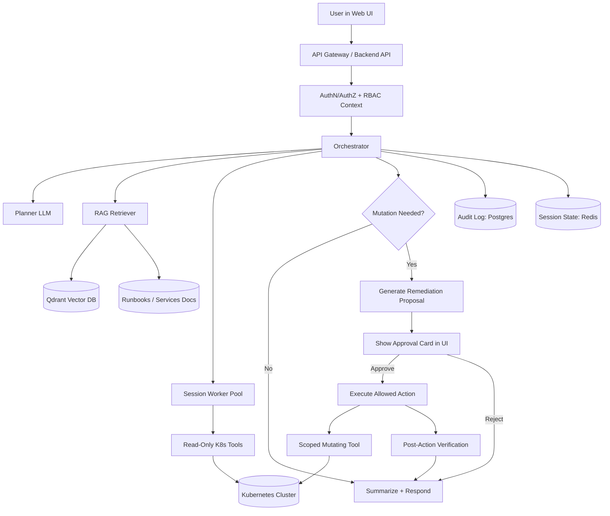
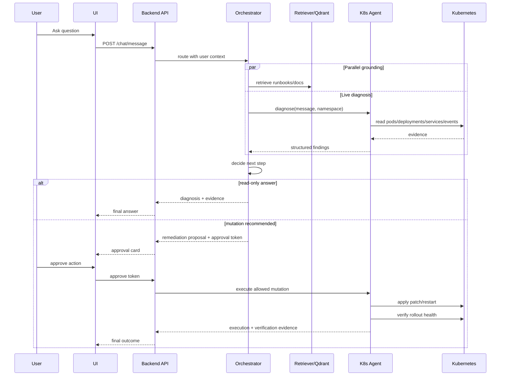

# Corrected K8s Agent Flow (Multi-User + Approval Gates)

## Why this correction

Spawning one Kubernetes pod for every user question is usually too expensive and slow for chat workloads.

A better default is:

- Keep a stateless API + orchestrator that handles all chat requests.
- Use a worker pool for concurrent sessions.
- Create short-lived child pods only when you need isolated execution (for example, long diagnostics, custom scripts, or risky tooling).

## Recommended Runtime Topology

## Approval Logic

- Read actions: no approval required.
- Mutating actions: approval required.
- Allowed mutations (allowlist):
  - set deployment image
  - rollout restart deployment
  - scale deployment
- Every proposal must include:
  - reason
  - exact target resource
  - preview command
  - expected impact
  - rollback suggestion

## Session and Concurrency Model

- Session key: user_id + cluster + namespace + conversation_id.
- Store in Redis:
  - current plan
  - pending approval proposal id
  - last evidence snapshot
- Worker pool handles parallel users safely.
- Optional child pod strategy:
  - create pod only for heavy or isolated tasks
  - attach TTL and cleanup job
  - mount least-privileged kubeconfig

## End-to-End Sequence

## Fit with current repository

This repository already implements most of this baseline:

- Planner and chat orchestration
- RAG retrieval from docs + Qdrant
- Diagnose endpoint with structured evidence
- Remediation endpoint with allowed action checks
- Approval token flow in backend chat handler

Major next upgrades:

- Persist pending approvals in Redis/Postgres instead of in-memory dict.
- Add policy engine for per-user and per-namespace mutation permissions.
- Add rollback proposal in remediation responses.
- Add child pod executor only for heavy/sandbox tasks.
